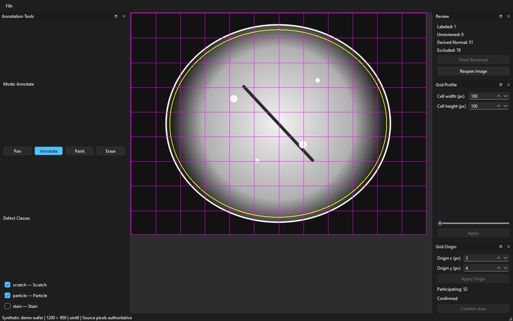
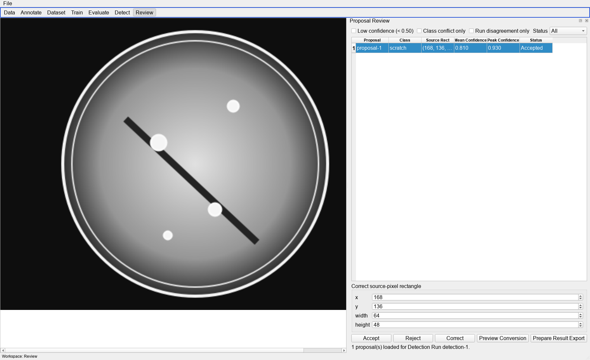
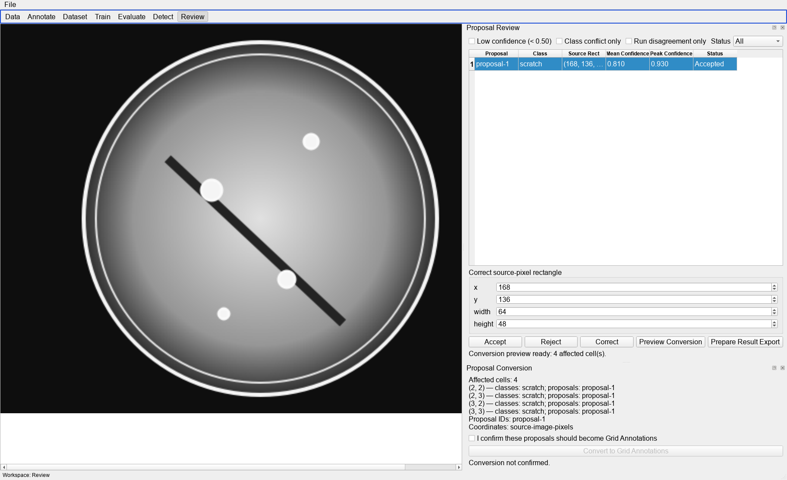
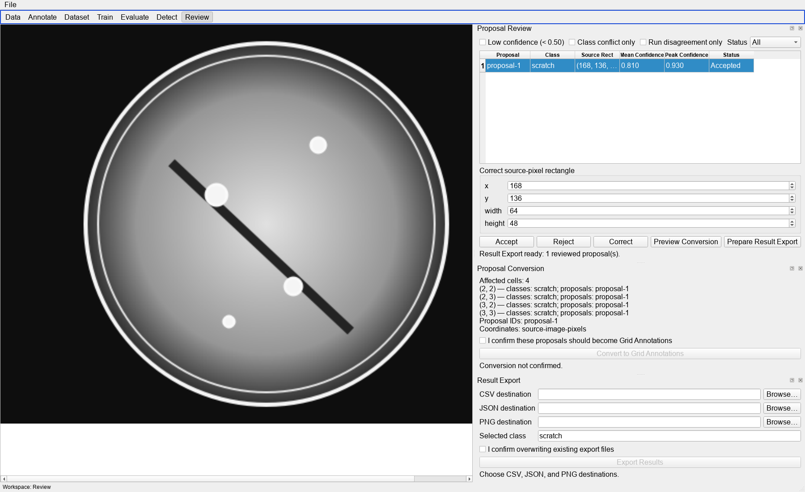

# Wafer Defect Studio

A Windows desktop MVP for source-pixel-aligned wafer grid classification. The
original grayscale pixels remain authoritative while the application supports
multi-label review, reproducible training snapshots, checkpoint-backed ResNet18
training and evaluation, all-convolutional approximate localization, proposal
review, conversion, and result export.



> The screenshots in this README use deterministic synthetic wafer data and
> real PySide6 Widgets renders. They are UI evidence, not production inspection
> data or model-accuracy claims.

## Current status

Phase 2 MVP is complete (Tickets 01–28). The intended MVP algorithm and its
active-project desktop happy path are now connected:

1. Import a native 8-bit or 16-bit grayscale wafer image.
2. Configure a pixel-sized Grid Profile and confirmed Effective Wafer Area.
3. Apply multi-label Grid Annotations and mark the image Reviewed.
4. Freeze a Dataset Snapshot, train ResNet18 from the frozen input bundle,
   evaluate the published checkpoint, choose thresholds, and approve the
   evaluation.
5. Create a Detection Profile from the approved evaluation, run overlapping
   full-resolution checkpoint inference, project layer4+FC as 1×1 convolution,
   and generate source-coordinate sigmoid confidence maps and proposals.
6. Review proposals, preview and explicitly confirm conversion to Grid
   Annotations, then prepare and publish CSV, JSON, and native-size PNG results.
7. Reopen the project with the Review filters and Result Export context intact.

The algorithm is complete for this Phase 2 MVP path. CAM regions, retained
thresholded confidence regions, and proposals are approximate weak localization,
not pixel-accurate segmentation masks.

### Phase 2 UI snapshots

<p>
  
  
  
</p>

### End-to-end demo

可用一個可重跑的 synthetic-source project 走過匯入、兩類標註、Dataset
Snapshot、真實 checkpoint-backed ResNet18 訓練、Evaluation approval、Detection
與 native-coordinate Heatmap/Regions/Both：

```powershell
$env:QT_QPA_PLATFORM = "offscreen"
$env:QT_QPA_FONTDIR = "C:/Windows/Fonts"
& 'E:\miniconda3\envs\wafer-defect-studio\python.exe' docs/demo/run_phase2_demo.py
```

完整步驟、每階段截圖、checkpoint checksum、標註與 Proposal 的正式比對數據，
以及 synthetic-source validation 邊界請參考
[Phase 2 端到端 Demo 教學](docs/demo/phase2-end-to-end-tutorial.md)。

## Capabilities

- Import and retain native 8-bit or 16-bit grayscale source pixels.
- Define versioned pixel-sized Grid Profiles and per-image grid origins.
- Confirm ellipse or polygon Effective Wafer Areas with strict center-point
  participation.
- Create multi-label Grid Annotations and track Reviewed state separately.
- Freeze Training Scopes, Dataset Snapshots, deterministic image-level splits,
  and normalization bounds.
- Run isolated PyTorch ResNet18 training from a Snapshot-backed input bundle,
  checkpoint-backed evaluation, threshold selection, and approval workers with
  persisted job state and recovery.
- Create approved-evaluation Detection Profiles, run overlapping-window
  all-convolutional sigmoid detection, retain thresholded connected regions,
  and persist source-coordinate Detection Runs and Proposals.
- Review Proposals with append-only Accept/Reject/Correct revisions.
- Preview and explicitly confirm Proposal-to-Grid Annotation conversion with
  run/profile/proposal provenance.
- Export reviewed results as CSV, JSON, and native-size PNG with source-image
  coordinates, selected-class CAM/retained-region context, and grid/proposal
  overlays. CSV/JSON Proposal schemas do not contain mask fields.

SQLite is the local source of truth. Source-image pixel coordinates are
authoritative throughout annotation, localization, conversion, and export.

## Requirements

- Windows desktop (validated locally on Windows 10.0.22631)
- Python 3.11
- PySide6 6.6 or newer
- NumPy
- PyTorch and torchvision
- CUDA is optional; GPU execution requires a compatible PyTorch build, NVIDIA
  driver, and an available device.

The source tree currently declares only PySide6 in `pyproject.toml`; install the
ML dependencies explicitly until package metadata is completed.

## Setup

```powershell
conda create -n wafer-defect-studio python=3.11 -y
conda activate wafer-defect-studio
python -m pip install numpy torch torchvision
python -m pip install -e .
```

For GPU use, install the CUDA-enabled PyTorch build appropriate for the machine,
then verify it:

```powershell
python -c "import torch; print(torch.cuda.is_available(), torch.version.cuda)"
```

The environment used for the latest local checks reported Python 3.11.15,
PySide6 6.11.2, NumPy 2.4.6, PyTorch 2.13.0+cu126, torchvision 0.28.0+cu126,
and CUDA available.

## Run

```powershell
wafer-defect-studio
```

This launches the editor shell and Project Hub. Use the File menu to create or
open a project, import a referenced Wafer Image, and move through the Data,
Dataset, Train, Evaluate, Detect, and Review workspaces.

## Validate

Run the repository suite headlessly:

```powershell
$env:QT_QPA_PLATFORM = "offscreen"
& 'E:\miniconda3\envs\wafer-defect-studio\python.exe' -m unittest discover -s tests -p "test*.py" -v
```

The latest local model-backed evidence is recorded in
[Ticket 28](.scratch/wafer-defect-classification/issues/28-model-backed-confidence-regions.md)
and the [MVP validation report](.scratch/wafer-defect-classification/mvp-validation-report.md):

- Ticket 28 focused suite: **53/53 passed** in the E conda environment.
- Full discovery: **155 tests**, with 4 known pre-existing Qt/offscreen
  canvas-geometry failures in `test_grid_controls`, `test_grid_overlay`,
  `test_image_grid_origin`, and `test_wafer_interaction`.
- The remaining tests passed; `py_compile` and `git diff --check` passed.

The end-to-end demo also completes real Snapshot-backed Training,
checkpoint-scored Evaluation, Approved Run Detection, and same-mask
Heatmap/Regions/Both rendering. Its observed checksum and metrics are kept in
[`docs/demo/screenshots/demo-summary.json`](docs/demo/screenshots/demo-summary.json);
synthetic source images and the small held-out split are explicit limitations.

Those four failures are outside the active Phase 2 project path and are kept
visible rather than reported as a green full suite.

Run the focused performance checks when needed:

```powershell
python benchmarks/first_useful_display.py
python benchmarks/interaction_feedback.py --samples 3
```

## Project layout

```text
src/wafer_defect_studio/                 Application, domain services, workers, Widgets
tests/                                   Unit, integration, UI-smoke, validation tests
benchmarks/                              First-display and interaction measurements
docs/images/                             README and Phase 2 UI screenshots
docs/adr/                                Architectural decisions
docs/agents/                             Domain and delivery rules
.scratch/wafer-defect-classification/    Product spec, tickets, and validation evidence
```

## Known limits and deferred roadmap

- `pyproject.toml` does not yet declare NumPy, PyTorch, or torchvision.
- CAM and proposal regions remain approximate weak localization; pixel masks
  and segmentation are intentionally out of scope.
- Comprehensive Wafer Evaluation, multi-run comparison, ResNet50,
  EfficientNet-B0, ONNX import/parity, active learning, backup/collect UI,
  advanced job control, polished dark theme, layout profiles, and image
  pyramids remain deferred.

SQLite remains the single local source of truth, and no deferred item is needed
to exercise the Phase 2 happy path shown above.
